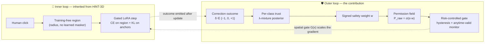
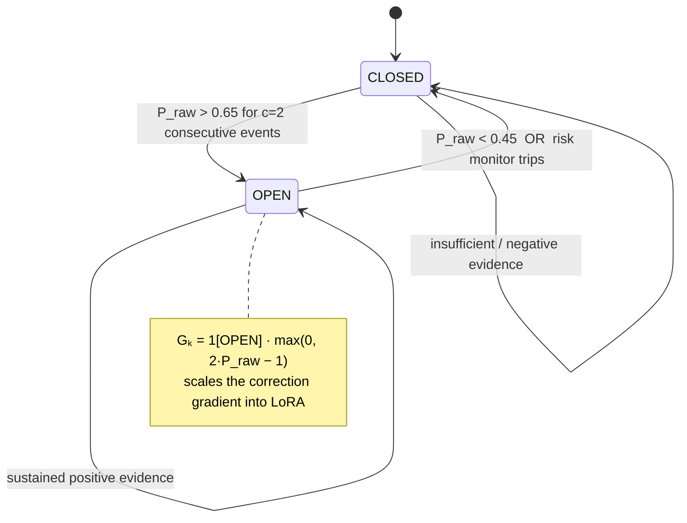
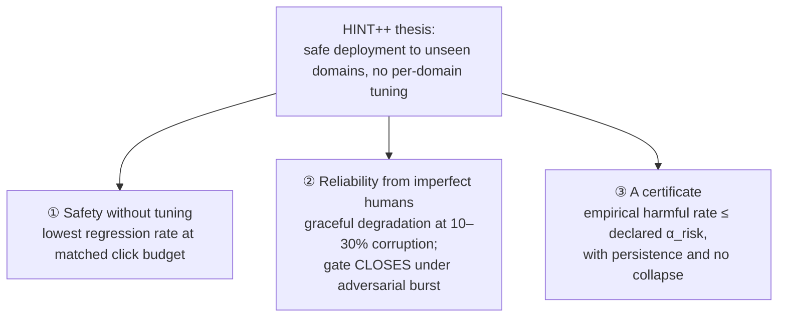
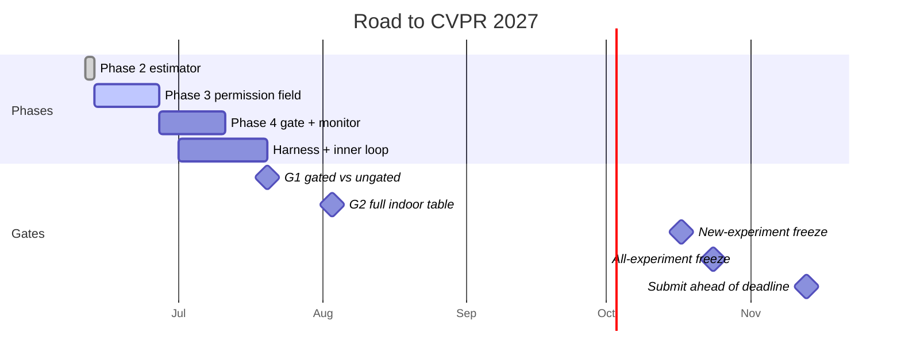

# HINT++ — The R1 Migration, at a Glance

    

> **What this document is.** A single narrative of how HINT++ changed from its pre-R1 design to the
> R1 spec: the flaws we found, *why* each one mattered, *how* we decided to fix it, and where the
> project is heading. For the authoritative spec see
> [`HINTpp_Design_Memo_R1_2026-06-11.md`](HINTpp_Design_Memo_R1_2026-06-11.md); for the operating
> rules see [`../CLAUDE.md`](../CLAUDE.md).

---

## TL;DR

The research goal never changed: **safe interactive test-time adaptation that deploys to unseen
domains without per-domain tuning.** What changed is that the pre-R1 design made several central
claims *true by construction* (so untestable) or *unimplementable*. R1 keeps the thesis and rebuilds
each claim so it can be **measured, falsified, and certified**.

| | **Before (pre-R1)** | **Now (R1)** |
|---|---|---|
| **Contribution** | "meta-learning transferable safety patterns from human correction history" | "longitudinal per-class trust state that **spatially gates** parameter updates, with **anytime-valid risk control**" |
| **Safety mechanism** | running max `P_safe` — permissions only ever *loosen* | **hysteresis gate + anytime-valid risk monitor** — the gate can *close* |
| **Trust estimator** | Adam bias-correction applied to a prior-initialized variance | **pseudo-count λ-mixture**, zero-init EMAs, prior enters only via λ |
| **Correction signal δ** | undefined (occurrence? label?) | **signed OUTCOME** ∈ {−1, 0, +1}, emitted *after* the gated update |
| **Eval protocol** | S3DIS(13 cls) → SemanticKITTI/nuScenes — *disjoint labels* | **two tracks**: indoor S3DIS↔ScanNet (shared classes); outdoor Synth4D→KITTI/nuScenes |
| **Headline metric** | permission-monotonicity violations (only *we* can score it) | **model-agnostic**: RER, CCC, risk-budget adherence |
| **Regions** | learned click-to-mask (ScanNet-trained) | **training-free** (radius); learned maskers demo-only |
| **Submission** | CVPR 2026, 7 phases | CVPR 2027, **two loops** |

---

## Table of contents
1. [What HINT++ is now — the two loops](#1--what-hint-is-now--the-two-loops)
2. [The eight design flaws and how we fixed them](#2--the-eight-design-flaws-f1f8)
3. [The estimator fix in depth (F3)](#3--the-estimator-fix-in-depth-f3)
4. [The empirical failure we found (S3DIS → ScanNet)](#4--the-empirical-failure-we-found-s3dis--scannet)
5. [How we decided — the principles behind the fixes](#5--how-we-decided--the-principles-behind-the-fixes)
6. [What changed in the repository](#6--what-changed-in-the-repository)
7. [The general direction](#7--the-general-direction)
8. [Status & pointers](#8--status--pointers)

---

## 1 · What HINT++ is now — the two loops

The paper is presented as **two loops, not seven phases**. The inner loop is inherited from the
predecessor HINT-3D; the outer loop is the contribution.



> **The one-sentence claim (never deviate):** *"HINT++ is the first interactive TTA method in which
> corrections maintain a longitudinal per-class trust state that spatially gates parameter updates,
> with anytime-valid risk control — enabling safe deployment to unseen domains without per-domain
> tuning."*

---

## 2 · The eight design flaws (F1–F8)

Each flaw broke a *specific* paper claim. The fix in every case was chosen to make that claim
**measurable** rather than rhetorical.

| # | What was wrong | Why it broke the paper | How we fixed it |
|---|---|---|---|
| **F1** | A 13-class S3DIS teacher was to be evaluated on SemanticKITTI/nuScenes — **disjoint label spaces, not domain shift** | The *primary experiment could not be run* | Two tracks: **indoor** S3DIS↔ScanNet on the shared-class intersection; **outdoor** Synth4D→KITTI/nuScenes (GIPSO/HGL), new PTv3 teacher |
| **F2** | Running max `P_safe = max(P_safe, P_raw)` — a **liveness** property, not safety: permissions only loosen, an adversarial burst opens a gate *forever*; its "theorem" was true by construction | The **central safety claim was vacuous** | **Hysteresis state machine + anytime-valid risk monitor**; the running max is *retired everywhere* (code, tests, docs, the term "monotone safety check" included) |
| **F3** | Zero-init bias correction applied to a **prior-initialized** variance inflates the prior ×19 at t=1 (β₂=0.95); "fixing" it gives instant full trust (m̂₁ = δ₁) | The trust signal was **math-broken from the first event** | **Pseudo-count prior mixture** λ = n₀/(n₀+N); zero-init internals only; prior enters solely through λ → [details below](#3--the-estimator-fix-in-depth-f3) |
| **F4** | δₖ was **semantically undefined** — occurrence vs outcome | The system's *input* was ambiguous | δₖ(t) ∈ {+1, −1} = **OUTCOME** of a correction event, emitted *after* the gated update (+1 = region error decreased; −1 = it didn't, or re-correction within T_rc) |
| **F5** | β rationale was **backwards** ("0.95 is slower/safer than Adam" — it is *faster*) | The design justification was wrong | Justify by **effective window under sparse events**: β₁=0.7 ≈ 3.3-event memory, β₂=0.95 ≈ 20-event |
| **F6** | Headline metric was **circular** — permission-monotonicity violations are trivially 0 for us, undefined for baselines | No **honest comparison** was possible | **Model-agnostic** metrics every method can score: RER, worst-stream mIoU, CCC, risk-budget adherence, mIoU@k, NoC |
| **F7** | Positioning was **stale** — Latte++ already claims "Interactive TTA" for 3D; HILTTA already uses human labels | The **novelty claim was exposed** | Scoped contribution sentence; baselines grouped *by what the human signal is used for*; **HILTTA-selection runs FIRST** (the most dangerous comparison) |
| **F8** | Learned click-to-mask models (AGILE3D, PinPoint3D, Point-SAM) are **trained on ScanNet** → target leakage | The **zero-shot claim was contaminated** | Regions are **training-free**; learned maskers are deployment-demo / future-work only, never in evaluation numbers |

### F2, visually — a gate that can actually close

The retired running max had **no path back** to a safer state. The R1 gate is a state machine whose
defining feature is that it *closes* — on its own threshold or when the risk monitor trips.



> **The deployment knob.** α_risk (with δ_conf = 0.05) is the **only** deployment-semantic knob: it
> declares a risk *budget*, like a significance level — it does not tune performance. Everything
> else is fixed once on source-side validation and reused unchanged across all four target streams.

---

## 3 · The estimator fix in depth (F3)

This is the change we actually implemented this session, in
[`src/safety/adaptive_moments.py`](../src/safety/adaptive_moments.py).

<details>
<summary><b>Before → After (click for the math)</b></summary>

**Before (pre-R1) — incoherent at t = 1**

```
m̂ = m / (1 − β₁ᵗ)          v̂ = v / (1 − β₂ᵗ)        with v initialised to the prior v₀
```
At the first event (t = 1, β₁ = 0.7, β₂ = 0.95):
```
m̂₁ = (1−β₁)·δ / (1−β₁) = δ              → the very first correction is trusted with weight 1.0
v̂₁ = [β₂·v₀ + (1−β₂)·δ²] / (1−β₂)
    = (β₂/(1−β₂))·v₀ + δ²  =  19·v₀ + δ²  → the carefully-set prior is blown up ×19
```
So the system reached *near-full trust on a single correction* — the opposite of "conservative
until evidence accumulates."

**After (R1) — pseudo-count λ-mixture, event-indexed**

```
λₖ  = n₀ / (n₀ + Nₖ)                    n₀ = 5,  Nₖ = per-class cumulative event count
m̂ₖ = (1 − λₖ) · m̃ₖ                     m̃, ṽ = zero-init, bias-corrected internals
v̂ₖ = λₖ · vₖ(0) + (1 − λₖ) · ṽₖ        prior enters ONLY through λ; it never decays inside the EMA
wₖ = η · ηₖ · m̂ₖ / (√v̂ₖ + ε)          SIGNED
```
Worked check (now a test): first event, δ=+1, n₀=5, v₀=0.6 ⇒ λ=⅚, m̂=⅙, v̂=⅔, **w ≈ 0.2041·η·ηₖ**.
Cold start: **Nₖ = 0 ⇒ λ = 1 ⇒ w = 0 exactly** (no events ⇒ no influence; composes with Prop 1).

</details>

| Property | Pre-R1 | R1 |
|---|---|---|
| First-event trust | **1.0** (instant) | **1/6** (damped by the prior) |
| Cold start (no events) | implicit | **w = 0 exactly**, per class |
| Prior handling | inflated ×19 by bias correction | mixed in via λ, never decays |
| δ values accepted | any float | **{−1, 0, +1}** only (validated) |
| Sign | ambiguous | **signed end-to-end** |
| Indexing | global step t | **per-class event count Nₖ** |
| Tests | 19 | **29** (incl. the worked check, sign, 10⁴ stability, F3 re-entry guard) |

> **Verification.** All 29 tests pass; the `safety-auditor` subagent returned **AUDIT: PASS, zero
> critical**, having independently re-derived the worked check and probed cold-start ε-leakage,
> per-class indexing, sign symmetry, and float32 underflow at 10⁴ events.

---

## 4 · The empirical failure we found (S3DIS → ScanNet)

Between Phase 2 and Phase 3 we ran the frozen S3DIS teacher **zero-shot** on 312 ScanNet scenes.
This is the empirical evidence that *motivates* the per-class permission field — and shows why a
single global confidence threshold (HINT-3D's conf > 0.7) is hopeless.

```
S3DIS Area-5 (in-domain)  ████████████████████  75.41% mIoU
ScanNet (zero-shot)       ███████████            42.03% mIoU   (gap −33.38 pp)
```

| Behaviour | Classes | IoU | Mean confidence | Implication for the permission field |
|---|---|---|---|---|
| ✅ **Transfers well** | floor, chair, wall, table | 0.64–0.94 | 0.87–0.98 | must stay ≈ 1 — *don't blanket-suppress* |
| ⚠️ **Graded failure** | sofa, bookcase | 0.32–0.49 | ~0.90 | output must be **continuous**, not a binary gate |
| ❌ **Overconfident-wrong** | ceiling, beam, column, board | **0.00** | **> 0.78** (ceiling 0.95) | must collapse a *whole class* to ≈ 0 **even at high softmax** |

> **The killer finding:** every wrong class still clears conf > 0.7, so a global threshold *triages
> nothing*. The permission field must be **per-class (P_k(x))** and conditioned on the Phase-2
> confidence ceiling η_k — not on raw softmax. This is the design target for Phase 3.

---

## 5 · How we decided — the principles behind the fixes

The fixes were not ad hoc. Each followed from one of five principles:

1. **Preserve the thesis, harden the claims.** The research direction (safety without tuning) is
   unchanged. Every fix turned a claim that was *true by construction* into one that can be
   **empirically falsified** (F2, F6).
2. **Safety must be a property you can lose.** A guarantee that can only get more permissive isn't
   safety. The gate must *close* under adversarial input — and that closure is a **blocking test**
   (F2).
3. **Every number must be scoreable by every method.** If a baseline can't produce the metric, the
   metric is rhetoric (F6).
4. **No leakage, ever.** Source-only statistics, training-free regions, zero-shot targets never
   tuned (F1, F8).
5. **Decisions are logged before code.** A deviation from the spec requires a decision record
   *first*. This migration is itself [DR-0001](decisions/DR-0001-adopt-r1-memo.md); the open
   outdoor-dataset choice is [DR-0002](decisions/DR-0002-outdoor-source-dataset.md).

These principles are now enforced by the repo: a [six-objection ledger](objections/ledger.md) keeps
every reviewer attack and its rebuttal live, and [`LESSONS.md`](LESSONS.md) distils the durable
lessons (e.g. *"a gate that can only open is liveness, not safety"*; *"never combine bias correction
with an informed prior"*).

---

## 6 · What changed in the repository

| Artifact | Before | After |
|---|---|---|
| `CLAUDE.md` | pre-R1 (7 phases, meta-learning, running max) | R1 spec, ≤150 lines, EXISTS/PLANNED directory map |
| Design memo | — | `docs/HINTpp_Design_Memo_R1_2026-06-11.md` (source of truth) |
| Skills | 7 flat `.md` files | **10** `<name>/SKILL.md` (4 rewritten, 4 new, 2 surgically edited) |
| Research log | — | decisions/ · objections/ledger · experiments/registry · reviews/ · changelog · **LESSONS L1–L8** |
| `src/safety/adaptive_moments.py` | bias-corrected prior estimator (F3) | **λ-mixture, event-indexed, signed** |
| Tests | 19 | **29** (every legacy change justified in a ledger atop the test file) |
| `configs/safety.yaml` | — | canonical hyperparameters (n₀, β₁, β₂, …) with a defaults-sync test |
| Feedback loop | — | `test-runner` + `safety-auditor` agents, PostToolUse pytest hook |

All of the above is on the review branch and bundled into **PR #1**.

---

## 7 · The general direction

The paper must demonstrate **three things** — nothing else is in scope:



Evaluation is **two tracks, zero target tuning**: indoor (primary) S3DIS↔ScanNet on shared classes;
outdoor (generality) Synth4D→SemanticKITTI/nuScenes. Experiments run **E1 → E2 → E3 → E4 → E5** in
that order; E3 (the adversarial burst, where the gate *must* close) is blocking.



**Immediate next steps**
- 🔴 **DR-0002 — outdoor source dataset (Synth4D vs SynLiDAR), due 2026-06-19.** The only dated open
  item; it blocks launching the outdoor teacher.
- ⬅ **Phase 3 — PermissionField.** Scoped and ready; design target = the per-class failures in §4.
- 🎯 **G1 (Jul 20)** is the critical path: gated-vs-ungated separation on a real ScanNet mini-run,
  which needs the inner-loop LoRA step + the evaluation harness skeleton.

---

## 8 · Status & pointers

| Phase | State |
|---|---|
| 1 · Frozen Teacher | ✅ S3DIS Area-5 mIoU 75.41% (`checkpoints/model_best.pth`) |
| 2 · Trust estimator | ✅ R1 λ-mixture, 29 tests, safety-auditor PASS |
| 3 · Permission Field | ⬅ next |
| 4 · Risk-Controlled Gate | ⬜ hysteresis + anytime-valid monitor |
| 5 · Exemplar Memory | ⬜ outcome events, recency-tempered replay |
| 6 · Full Integration | ⬜ zero-init rank-4 LoRA, gated gradient, KL stabilization |
| 7 · Two-track evaluation | ⬜ E1–E5 |

**Read next**
- 📜 Spec — [`HINTpp_Design_Memo_R1_2026-06-11.md`](HINTpp_Design_Memo_R1_2026-06-11.md)
- ⚙️ Operating rules — [`../CLAUDE.md`](../CLAUDE.md)
- 🧾 Decisions — [`decisions/`](decisions/) · Objections — [`objections/ledger.md`](objections/ledger.md) · Lessons — [`LESSONS.md`](LESSONS.md)
- 🔬 Empirical detail — `experiments/cross_domain/SCANNET_ZERO_SHOT_FINDINGS.md`

<sub>Formal claims: <b>Prop 1</b> zero corrections ⇒ output ≡ frozen teacher · <b>Prop 2</b> KL budget bounds anchor drift (Pinsker) · <b>Thm 1</b> anytime-valid risk control. Every paper claim must trace to a table, figure, or one of these.</sub>
