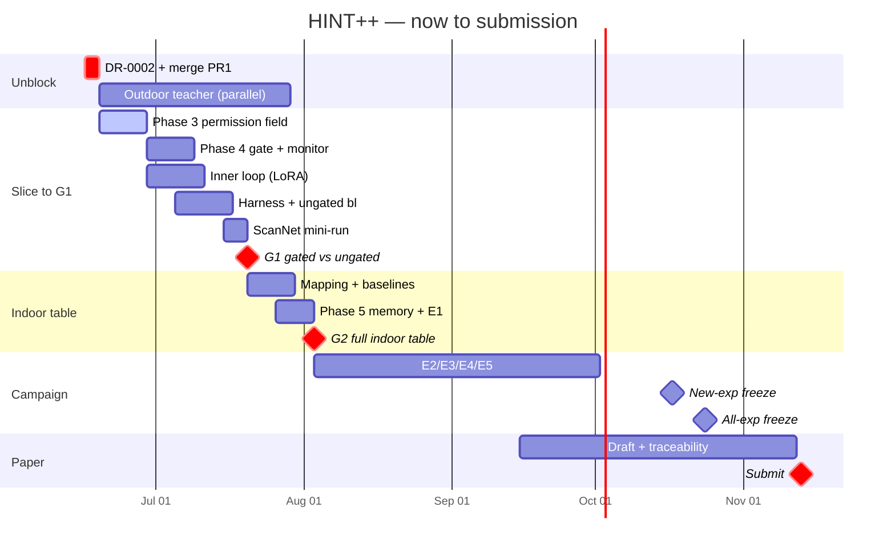

# HINT++ — Roadmap & Architecture-Change Ledger

   

> **What this is.** Two things in one file: **Part A** — a component-by-component ledger of what the
> *pre-R1* architecture would have done vs what the *R1* architecture does, every change and why;
> **Part B** — the exact, gate-anchored step sequence from today to submission. Authoritative spec:
> [`HINTpp_Design_Memo_R1_2026-06-11.md`](HINTpp_Design_Memo_R1_2026-06-11.md). Rules:
> [`../CLAUDE.md`](../CLAUDE.md). Narrative: [`R1_MIGRATION_OVERVIEW.md`](R1_MIGRATION_OVERVIEW.md).
> Baselines: [`related_work_scan.md`](related_work_scan.md).
>
> **The one rule that shapes Part B:** build order follows the **gates**, not the phase numbers. G1
> (Jul 20) needs a *vertical slice* (permission field + gate + a minimal LoRA inner loop + harness),
> so Phase 6's inner loop is **pulled forward** and **Phase 5 is deferred** until after G1.

---

## Part A — Architecture-change ledger (pre-R1 → R1)

### A0 · At a glance

| # | Component | Pre-R1 (what we *would* have done) | R1 (what we do now) | Flaw fixed | Status |
|---|---|---|---|---|---|
| A1 | Contribution & framing | "meta-learning transferable safety patterns"; 7 phases | per-class trust → spatial gate → anytime-valid risk; **2 loops** | F7 | ✅ |
| A2 | Trust estimator | Adam bias-correction on a **prior-initialized** v | **λ-mixture pseudo-count**, zero-init, event-indexed, signed | F3 | ✅ done |
| A3 | Correction signal δ | undefined (occurrence? label?) | **signed OUTCOME** ∈ {−1,0,+1}, emitted after the gated update | F4 | ✅ |
| A4 | β rationale | "0.95 is slower/safer than Adam" (backwards) | effective-window under sparse events (β₁≈3.3, β₂≈20) | F5 | ✅ |
| A5 | Permission field | generic P(x) ∈ [0,1] | **P_raw = σ(α·w)**, per-class, conditioned on η_k | — | ⬅ next |
| A6 | Safety check / gate | running max **`P_safe = max(P_safe,P_raw)`** ("monotone safety check") | **hysteresis state machine + anytime-valid risk monitor** | **F2** | ⬜ |
| A7 | Exemplar memory | M sufficient statistics for meta-learning | **outcome events**, recency-tempered replay | — | ⬜ |
| A8 | Adapter / inner loop | "meta-learning loop across domains" | zero-init rank-4 LoRA + gated CE + KL stabilization | — | ⬜ |
| A9 | Evaluation protocol | S3DIS→{ScanNet,SemKITTI,nuScenes} as "domain shift" | **two tracks**: indoor S3DIS↔ScanNet (shared cls), outdoor Synth4D→KITTI/nuScenes | **F1** | ⬜ |
| A10 | Metrics | permission-monotonicity violations; "violations <15%" | **RER, CCC, worst-stream, risk-budget adherence**, mIoU@k, NoC | F6 | ⬜ |
| A11 | Baselines | vague list | grouped **by signal use**; HILTTA-selection runs FIRST | F7 | ✅ scoped |
| A12 | Regions | learned maskers (AGILE3D, Point-SAM…) | **training-free** radius; learned maskers demo-only | F8 | ✅ scoped |
| A13 | Formal claims | one "monotonicity theorem" (true by construction) | **Prop 1 / Prop 2 / Thm 1** | F2/F6 | partial |

---

### A1 · Contribution & framing
**Was:** *"We enable zero-shot safe deployment of interactive TTA to unknown domains by meta-learning
transferable safety patterns from human correction history."* Presented as a 7-phase pipeline.
**Now:** *"HINT++ is the first interactive TTA method in which corrections maintain a longitudinal
per-class trust state that spatially gates parameter updates, with anytime-valid risk control —
enabling safe deployment to unseen domains without per-domain tuning."* Presented as **two loops**
(inner = inherited HINT-3D click→region→gated-LoRA; outer = δ→trust→permission→gate→monitor).
**Why:** F7 — "meta-learning" overclaimed and collided with ITTA/HILTTA. **Where:** `CLAUDE.md`, memo §1.

### A2 · Trust estimator — Phase 2 ✅ DONE (`src/safety/adaptive_moments.py`)
**Was (pre-R1):** Adam-style bias correction applied to a *prior-initialized* second moment —
```
mₖ = β₁mₖ + (1−β₁)δ ;   m̂ₖ = mₖ / (1 − β₁ᵗ)
vₖ = β₂vₖ + (1−β₂)δ² ;  v̂ₖ = vₖ / (1 − β₂ᵗ)        # vₖ initialised to the prior vₖ(0)
wₖ = η·ηₖ·m̂ₖ / (√v̂ₖ + ε)
```
Failure: at t=1 this gives `m̂₁ = δ` (instant full trust) and inflates the prior **×19** (β₂=0.95).
**Now (R1):** zero-init EMAs, **event-indexed on per-class Nₖ**, prior injected only via a pseudo-count
mixture —
```
per event:  mₖ = β₁mₖ + (1−β₁)δ ;  vₖ = β₂vₖ + (1−β₂)δ²        # zero-init, updated only for the event's class
m̃ₖ = mₖ /(1−β₁^{Nₖ}) ;  ṽₖ = vₖ /(1−β₂^{Nₖ})                  # bias-correct ONLY the zero-init internals
λₖ = n₀/(n₀+Nₖ),  n₀ = 5                                       # configs/safety.yaml: safety.n0
m̂ₖ = (1−λₖ)·m̃ₖ
v̂ₖ = λₖ·vₖ(0) + (1−λₖ)·ṽₖ                                     # vₖ(0)=0.5rₖ+0.5uₖ (Sub-step 0B), immutable buffer
wₖ = η·ηₖ·m̂ₖ /(√v̂ₖ + ε)                                       # SIGNED
```
Worked check (test): first event, δ=+1, n₀=5, vₖ(0)=0.6 ⇒ **w ≈ 0.2041·η·ηₖ**. Cold start **Nₖ=0 ⇒
λ=1 ⇒ w=0 exactly**. **Why:** F3. **Status:** 29 tests, safety-auditor PASS, branch `feat/phase2-r1`.

### A3 · Correction signal δ — ✅ (F4)
**Was:** "δₖ(t): correction signal for class k" — never said whether it's an occurrence, a label, or
an outcome. **Now:** δₖ(t) ∈ {+1, −1} is the **OUTCOME** of a correction event, emitted *after* the
gated update: **+1** = local error on the corrected region decreased; **−1** = it did not, or the
region was re-corrected within T_rc events. (δ=0 in a forward call = "no event for that class.") The
estimator now **validates** δ ∈ {−1,0,+1}. **Why:** a system whose input is undefined cannot be tested.

### A4 · β rationale — ✅ (F5)
**Was:** justified as "β₂=0.95 is slower/safer than Adam" — backwards (0.95 is *faster* than 0.999).
**Now:** justified by **effective window under sparse events**: β₁=0.7 ≈ 3.3-event memory, β₂=0.95 ≈
20-event. Asserted `0 < β₁ < β₂ < 1` in `__init__`. **Why:** the design rationale was simply wrong.

### A5 · Permission field — Phase 3 ⬅ NEXT (`src/safety/permission_field.py`, to create)
**Was:** a generic spatial field "P(x) ∈ [0,1]" with no stated functional form or conditioning.
**Now:** **P_raw,ₖ = σ(α·wₖ)** per class; spatial **P_raw(x) = P_raw,ŷ(x)**; must (i) be **per-class**
(a global threshold filters nothing — see the ScanNet finding), (ii) collapse a whole class to ≈0 even
at softmax conf 0.95 (ceiling/beam/column/board), (iii) stay ≈1 for reliable classes
(floor/wall/chair), (iv) be **continuous** for graded failures (sofa/bookcase), (v) be conditioned on
the Phase-2 ceiling **η_k**, not raw softmax. **Why:** the cross-domain failure (42.03% mIoU, conf>0.7
triages nothing) is the design target. **Where:** memo §4 (first clause), `phase-implement` skill.

### A6 · Safety check → Risk-Controlled Gate — Phase 4 ⬜ (F2, the headline change)
**Was — RETIRED:** `P_safe = max(P_safe, P_raw)` ("Monotone Safety Check — safety never regresses").
This is a **liveness** property: permissions can only *loosen*; one adversarial burst opens a gate
**forever**; its "theorem" was true by construction. The old repo even flagged an open issue that the
running max "requires stable per-point identity across calls."
**Now:** a per-class **hysteresis state machine** + an **anytime-valid risk monitor** —
```
state gₖ ∈ {CLOSED, OPEN}
OPEN  when  P_raw > θ_hi = 0.65  for c = 2 consecutive events
CLOSE when  P_raw < θ_lo = 0.45  OR  the risk monitor trips
Gₖ = 1[OPEN] · max(0, 2·P_raw − 1) ;  spatial G(x) = G_ŷ(x)  scales the correction gradient into LoRA
monitor: anytime-valid confidence sequence on per-class harmful rate hₜ∈{0,1} (pooled fallback for
         rare classes); trip when the LOWER bound > α_risk (δ_conf = 0.05)
```
**α_risk is the ONLY deployment-semantic knob.** The term "monotone safety check" and the running max
are **forbidden everywhere** (code, tests, docs, paper). **Why:** F2. **Where:** memo §4. The
**gate-closure-under-adversarial-burst test is BLOCKING** (`safety-check` skill).
**Files (to create):** `src/safety/gate.py`, `src/safety/risk_monitor.py` + tests.

### A7 · Exemplar memory — Phase 5 ⬜ (`src/memory/exemplar_memory.py`, to create)
**Was:** "M sufficient statistics, one per correction" feeding a meta-learning loop across domains.
**Now:** stores **outcome-event** sufficient statistics (class, δ, region stats, timestamp) — **never
raw point tensors** — with **recency-tempered replay** and a bounded size + eviction. **Why:** the
meta-learning framing is retired; memory exists to manufacture reliability from imperfect humans (E2)
and keep gates closed against repeat adversaries (E3). Not on the G1 critical path → **deferred**.

### A8 · Adapter / inner loop — Phase 6 ⬜ (`src/adaptation/`, `src/models/`, to create)
**Was:** described as a "meta-learning loop across domains." **Now (unchanged mechanism, reframed):**
**zero-init LoRA rank 4** in the last 2–3 PTv3 blocks; **gated CE** on the corrected region +
**λ_stab·KL** on high-confidence anchors; **two stop-gradients** as in HINT-3D; region is
**training-free** (radius). This is the HINT-3D inner loop **reimplemented from memo §8** (we have the
spec, not the original code — that's fine; see the design-decision discussion). **Why:** zero-init
LoRA is what makes Prop 1 hold; meta-learning across domains was scope creep.

### A9 · Evaluation protocol — Phase 7 ⬜ (F1)
**Was:** a 13-class S3DIS teacher evaluated on **ScanNet, SemanticKITTI, nuScenes** as if all were
"domain shift" — but SemanticKITTI/nuScenes have **disjoint label spaces**, so the primary experiment
was unrunnable. **Now — two tracks, zero target tuning:**
- **Indoor (primary):** S3DIS→ScanNet and ScanNet→S3DIS on the **~8 shared classes** (mapping table to
  be built → `docs/`).
- **Outdoor (generality):** Synth4D→SemanticKITTI and Synth4D→nuScenes (GIPSO/HGL protocol), **new
  PTv3 teacher** (source dataset pending **DR-0002**).
**Why:** F1. Targets are zero-shot — never trained, tuned, or used for feedback statistics.

### A10 · Metrics — ⬜ (F6)
**Was:** headline = **permission-monotonicity violations** (trivially 0 for us, undefined for
baselines) and "violations <15% on all three domains." **Now — model-agnostic, every method can
score them:** **RER** (% scenes with post-adapt mIoU < teacher − 1.0pt), **worst-stream mIoU**, **CCC**
(% streams with any shared class >10 IoU below teacher), **risk-budget adherence** (empirical harmful
rate vs α_risk), **mIoU@k clicks**, **NoC@target**, **gain-per-click**, plus s/round (~0.5 target),
memory, % params. All **≥3 seeds, mean±std, matched budgets**. **Why:** F6.

### A11 · Baselines — ✅ scoped (F7; locked in `related_work_scan.md`)
**Was:** a vague list (HINT-3D source thresholds, HINT-3D tuned, "HINT++"). **Now — grouped by what
the human signal is used for:** `signal=none` (frozen, TENT[LN affine], EATA, SAR, CoTTA, episodic
reset, GIPSO+HGL outdoor) · `signal=supervision` (HINT-3D source-thresholds, HINT-3D tuned,
ungated-LoRA) · `signal=selection` (**HILTTA-style — runs FIRST**, most dangerous) · `signal=governance`
(HINT++, oracle-tuned HINT++ ceiling). **Why:** F7.

### A12 · Regions — ✅ scoped (F8)
**Was:** would have used learned click-to-mask models (AGILE3D, Point-SAM, PinPoint3D). **Now:**
regions are **training-free** (radius default; geometric growing only via a decision record). The scan
confirmed every SOTA masker is trained on a target dataset (AGILE3D=ScanNet, Interactive4D=KITTI+nuScenes)
→ **leakage**; they are deployment-demo / future-work only, never in evaluation numbers. **Why:** F8.

### A13 · Formal claims — partial
**Was:** a single "monotonicity theorem" (the running max never decreases) — true by construction,
hence vacuous. **Now:** **Prop 1** zero corrections ⇒ output ≡ frozen teacher (zero-init LoRA, numeric
identity test) · **Prop 2** KL budget bounds anchor drift via Pinsker ‖p′−p‖₁ ≤ √(2·KL), per-round KL
logged · **Thm 1** anytime-valid risk control (gates open only while the harmful rate is consistent
with ≤ α_risk). See the verification map in Part C.

---

## Part B — Step-by-step roadmap to submission

Legend: 🔲 to do · each step lists **[file/artefact]**, the **done-when** test, the **skill**, and any
**formal claim** it discharges. Run `session-wrap` at the end of every session; `safety-auditor` +
pytest on every safety diff; register every experiment.

### Stage 0 — Unblock & settle · now → **Jun 19**
- 🔲 **Review + merge PR #1** to `master` (the R1 bootstrap + Phase 2). *Done-when:* master reflects R1.
- 🔲 **Decide DR-0002** (Synth4D vs SynLiDAR) — fill the Decision section. *Input from the scan:* HGL
  uses SynLiDAR as a source (protocol precedent). **[`docs/decisions/DR-0002-outdoor-source-dataset.md`]**
  *Done-when:* status flips to `accepted`. → `research-log`. **Due Jun 19.**
- 🔲 *(parallel, long pole)* start **outdoor PTv3 teacher** training once DR-0002 lands. **[`checkpoints/`, `experiments/configs/outdoor_teacher.*`]**

### Stage 1 — Vertical slice to **G1 (Jul 20)**: *gated beats ungated on a real ScanNet mini-run*
Critical path; build in this dependency order.
1. 🔲 **Phase 3 — Permission Field.** P_raw=σ(α·w), per-class, η_k-conditioned. **[`src/safety/permission_field.py`, `tests/test_permission_field.py`]** *Done-when:* P_raw∈(0,1); w=0⇒P_raw=0.5 and G-contribution=0; monotone in w both signs; α in `configs/safety.yaml`. → `phase-implement`+`safety-check`.
2. 🔲 **Phase 4 — Risk-Controlled Gate + monitor.** Hysteresis (θ_hi=0.65,c=2 / θ_lo=0.45) + anytime-valid monitor (α_risk, δ_conf=0.05). **[`src/safety/gate.py`, `src/safety/risk_monitor.py`, tests]** *Done-when:* **gate-closure-under-burst test passes (BLOCKING)**; two-sided monitor calibration; **Thm 1** instantiable. → `safety-check`.
3. 🔲 **Inner loop** (Phase 6, pulled forward). Zero-init rank-4 LoRA on last 2–3 PTv3 blocks + gated CE on region + λ_stab·KL on anchors + training-free radius region. **[`src/models/ptv3_lora.py`, `src/adaptation/inner_loop.py`, `src/adaptation/regions.py`, tests]** *Done-when:* **Prop 1** numeric identity test passes (0 clicks ⇒ teacher exactly); **Prop 2** per-round KL logged.
4. 🔲 **Harness skeleton.** `MethodAdapter`(reset/predict/adapt_round), `run_stream`, deterministic AGILE3D-protocol simulator (noise + burst modes), versioned MetricsJSON, append-only results w/ git SHA + config hash. **[`harness/runner.py`, `harness/adapters/base.py`, `harness/simulator.py`, `harness/metrics.py`, golden tests]** → `eval-harness`.
5. 🔲 **ungated-LoRA baseline** = gate-off flag (ONE flag, shares all HINT++ code). **[`harness/adapters/ungated_lora.py`]**
6. 🔲 **ScanNet mini-run:** gated vs ungated, ≥3 seeds, matched click budget; register row. **[`experiments/configs/g1_mini.*`, `experiments/results/EXP-*/`, `docs/experiments/registry.md`]**

✅ **G1 (Jul 20):** statistically clean gated > ungated separation. **Fail → debug; pivot by Jul 31.**
🚫 **Do NOT build Phase 5 yet.**

### Stage 2 — Full indoor table to **G2 (Aug 3)**
1. 🔲 **Shared-class mapping table** S3DIS↔ScanNet (~8 classes). **[`docs/s3dis_scannet_shared_classes.md`]**
2. 🔲 **Baselines behind `MethodAdapter`**, each with a **reproduce-one-published-number gate**, in order: **HILTTA-selection FIRST**, then frozen · TENT(LN affine) · EATA · SAR · CoTTA · episodic reset · HINT-3D source-thresholds · HINT-3D tuned. **[`harness/adapters/*.py`]** → `baseline-implement`.
3. 🔲 **Phase 5 — Exemplar Memory** (persistence foil for E4). **[`src/memory/exemplar_memory.py`, tests]**
4. 🔲 **Run E1 indoor**, both directions, ≥3 seeds. **[`experiments/configs/e1_indoor.*`, results, registry]**

✅ **G2 (Aug 3):** full indoor table vs all four families.
⚠️ **Outdoor descope checks Jul 24 / Aug 7** — if the outdoor teacher/result isn't on track, descope to indoor-only via a DR.

### Stage 3 — Experiment campaign **E1→E5** · Aug 3 → freezes
Run in this exact order (E5 only after E1 passes):
- 🔲 **E1** primary two-track table (add outdoor unless descoped).
- 🔲 **E2** noisy-oracle sweep p∈{0,10,20,30}% — graceful-degradation curve.
- 🔲 **E3** adversarial burst — **gate MUST close (BLOCKING)**.
- 🔲 **E4** persistence vs episodic reset.
- 🔲 **E5** ablations: gate-off (have it), no-monitor, no-prior/λ, β-symmetric, n₀ sensitivity.

✅ **New-experiment freeze Oct 17** (no new experiments after) · **all-experiment freeze Oct 24** (numbers locked). All ≥3 seeds, mean±std, registered, **numbers script-generated** from `experiments/results/`.

### Stage 4 — Paper · overlap ~Sep → **submit ~Nov 13** (abstract ~1 week earlier)
- 🔲 Draft alongside experiments; tables/figures **auto-generated** from results (no hand numbers). **[`paper/sections/`, `paper/tables/`, `paper/figures/`]** → `paper-section`.
- 🔲 Sections: method (two loops) → related work (five clusters, scan done) → experiments (E1 first) → intro → formal claims (Prop 1/2, Thm 1) → limitations.
- 🔲 **Claims-traceability pass** (every claim → table/fig/Prop/Thm) + **hostile internal review vs the six objections** (`objections/ledger.md`).
- ✅ **Submit ≥48 h early.**



---

## Part C — Standing rules & formal-claim verification map

**Every step, no exceptions:** DR in `docs/decisions/` before any **spec** deviation (resequencing
phases is a *schedule* choice, not a spec deviation) · register every launch in
`docs/experiments/registry.md` · ≥3 seeds, mean±std, matched budgets · `safety-auditor` + `pytest`
on every safety diff (PostToolUse hook enforces the mapped target) · `session-wrap` each session ·
**no hand-edited numbers** · ScanNet/SemanticKITTI/nuScenes never trained/tuned/used for feedback.

| Claim | Statement | Verified by | Stage |
|---|---|---|---|
| **Prop 1** | 0 corrections ⇒ output ≡ frozen teacher | numeric identity test on zero-init LoRA | Stage 1 (inner loop) |
| **Prop 2** | KL budget bounds anchor drift (Pinsker) | per-round KL logged; checked vs √(2KL) | Stage 1 → reported E1 |
| **Thm 1** | anytime-valid risk control ≤ α_risk | monitor design + empirical adherence | Stage 1 (monitor) → E1–E3 |

## Appendix — artefact map (✅ exists · ⬜ to create)

```
✅ src/safety/adaptive_moments.py      ⬜ src/safety/permission_field.py  (Phase 3)
⬜ src/safety/gate.py risk_monitor.py  ⬜ src/models/ptv3_lora.py         (Phase 6 inner loop)
⬜ src/adaptation/inner_loop.py regions.py   ⬜ src/memory/exemplar_memory.py (Phase 5)
⬜ harness/runner.py adapters/ simulator.py metrics.py
✅ configs/safety.yaml                 ⬜ configs/ gate/monitor keys · experiments/configs/
✅ docs/ (memo, decisions, registry, objections, LESSONS, scans)  ⬜ docs/s3dis_scannet_shared_classes.md
⬜ paper/sections|tables|figures        ✅ checkpoints/model_best.pth (indoor teacher) · ⬜ outdoor teacher
```

<sub>Dates from CLAUDE.md "Gates & Freezes" and memo §10; CVPR 2027 deadline ~Nov 13 2026 (verify on announcement). Component facts cross-checked against the pre-R1 CLAUDE.md (git history) and the R1 memo §2–§11.</sub>
