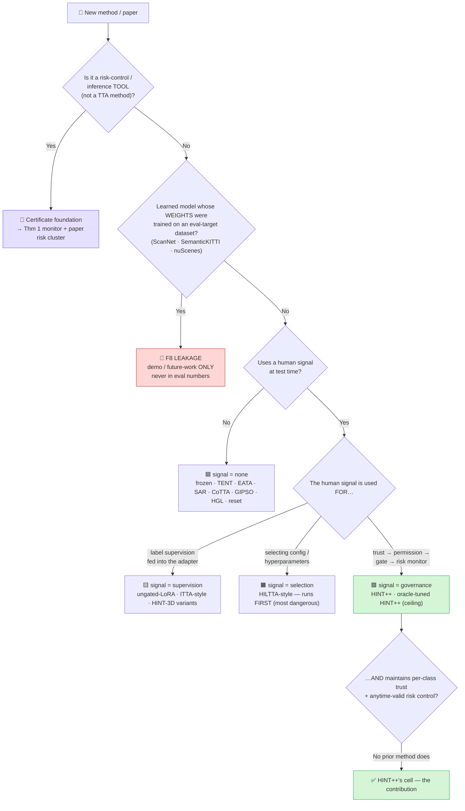
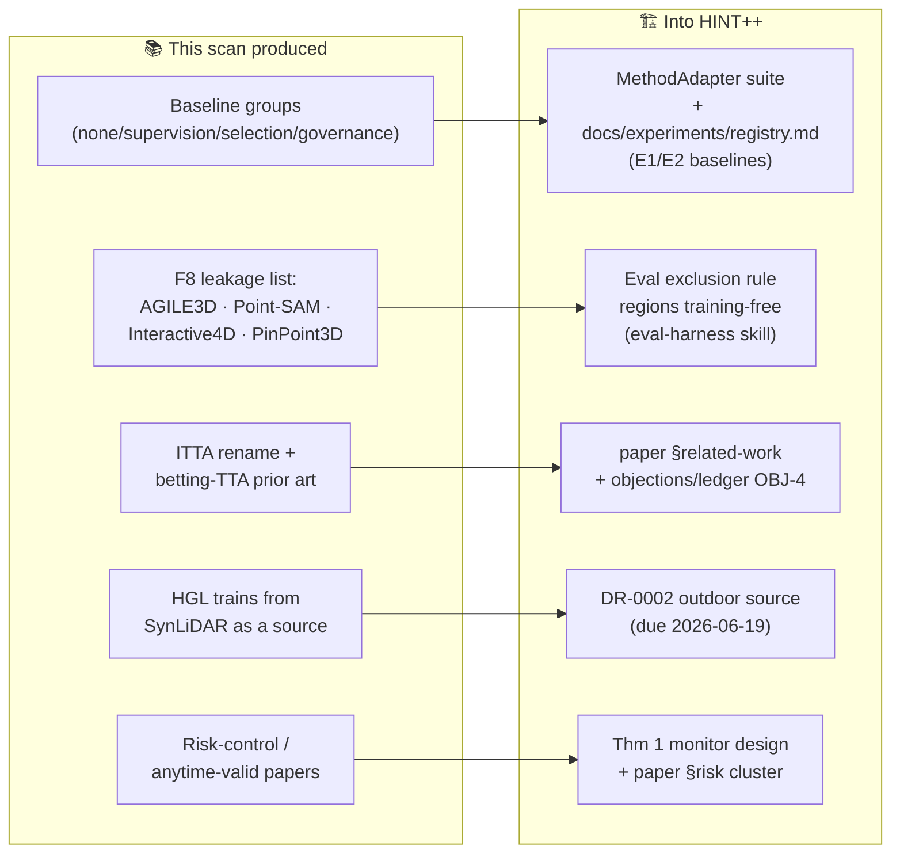

# HINT++ — Related-Work & Baseline Scan

 -brightgreen)  

> **What this is.** A web literature scan (2023–2026) run to (a) **lock the baseline suite** and
> (b) **validate related-work positioning** before Phase 3. It maps every relevant method into the
> R1 baseline buckets (`signal = none / supervision / selection / governance`, memo §9) and flags
> target-domain leakage (flaw F8). Companion docs: spec
> [`HINTpp_Design_Memo_R1_2026-06-11.md`](HINTpp_Design_Memo_R1_2026-06-11.md), migration narrative
> [`R1_MIGRATION_OVERVIEW.md`](R1_MIGRATION_OVERVIEW.md), objections
> [`objections/ledger.md`](objections/ledger.md).
>
> **Method:** direct WebSearch/WebFetch over arXiv/CVPR/ICCV/ECCV/ICLR/NeurIPS/ICRA. Confidence is
> annotated per claim; items marked *to-verify* need the full PDF before they enter the paper.

---

## 1 · Bottom line

**The novelty claim survives — but only in its scoped form.** No existing method combines all three
HINT++ clauses: (a) human-correction **outcomes** as the signal, (b) a longitudinal **per-class
trust state that spatially gates parameter updates**, (c) **anytime-valid risk control** on harmful
updates. The pieces exist *separately*; never the conjunction.

> ⚠️ **Wording risk.** Do **not** claim "first *interactive TTA*" unqualified — that term is already
> owned by **ITTA** (arXiv:2403.06461). Keep the exact contribution sentence, whose qualifying
> clauses ("…in which corrections maintain a longitudinal per-class trust state that spatially gates
> parameter updates, with anytime-valid risk control…") are what make it true.

## 2 · Citation audit (memo §2 / §9)

| Memo cite | Status | Correction / note |
|---|---|---|
| **HILTTA** = arXiv:2405.18911 | ✅ exists; characterization accurate | *"Exploring Human-in-the-Loop TTA by Synergizing Active Learning and Model Selection"* (Li, Su, Yang, Jia, Xu). Human labels are spent on **sample selection + hyperparameter/model selection** → confirms `signal=selection`. Image-classification TTA (*to-verify: exact benchmarks*); port the **strategy**, not the code. |
| **Latte++** = arXiv:2403.06461 | ✅ exists; **misnamed** | The interactive HITL method in that paper is **ITTA**; **Latte++** is its temporal-stability sibling (multi-window MM-TTA). **Cite the interactive contribution as ITTA.** |

---

## 3 · How to use this scan in the HINT++ system

This section is the operating manual for everything below: a **triage lens** for routing any method,
and a **feeds-into map** from this scan's findings to concrete repo artifacts.

### 3a · Triage lens — where does any method go?

Run every candidate method through this before it touches the evaluation harness.

**Two hard gates in that tree:**
- **Leakage gate (Q1).** A learned model whose weights saw an evaluation-target dataset can never
  produce an evaluation number — only a deployment demo. This is why **regions stay training-free**
  (radius) and learned maskers are out (F8).
- **Novelty gate (CLAIM).** The governance cell is occupied only by HINT++; any future paper that
  lands there is a direct competitor and must be re-triaged immediately.

### 3b · Feeds-into map — findings → repo artifacts

> **Reading it:** the left column is what the scan *establishes*; the right column is where each
> finding is *consumed*. Nothing here changes those artifacts yet — §12 lists the patches as
> recommendations to apply on approval.

---

## 4 · Cluster 1 — Human-in-the-loop / interactive TTA (closest competitors)

| Method | Human signal → used for | 2D/3D · online | Trust? Risk cert? | Verdict for HINT++ |
|---|---|---|---|---|
| **ITTA** (2403.06461, v5 Oct'25) | clicks + bboxes → **label supervision** via a promptable branch (momentum gradient) | 3D multi-modal (cam+LiDAR), online | ❌ / ❌ | **Closest competitor.** Differs on the entire outer loop. → related-work anchor; candidate `signal=supervision` baseline (*caveat: multi-modal; may not port to single-modal indoor*) |
| **HILTTA** (2405.18911) | labels → **selection** of TTA config/hyperparameters | 2D image cls, online | ❌ / ❌ | `signal=selection` baseline, **runs FIRST** |
| **Protected TTA — "betting approach"** (2408.07511, Bar/Shaer/Romano '24) | none (no human) | 2D image cls, online | partial — shift **detection** only | Nearest prior art for *anytime-valid in TTA*; **cite**, does not pre-empt |

## 5 · Cluster 2 — Interactive 3D maskers (the F8 leakage check)

**All learned, all trained on target/indoor data → none may enter evaluation numbers.**

| Masker | Trained on | Leakage verdict |
|---|---|---|
| **AGILE3D** (2306.00977, ICLR'24) | **ScanNetV2-train only** (zero-shot eval on S3DIS, KITTI-360) | ❌ leaks for S3DIS→ScanNet — confirms F8 exactly |
| **Interactive4D** (2410.08206, ICRA'25) | **SemanticKITTI + nuScenes** scans | ❌ leaks for the outdoor track |
| **Point-SAM** (2406.17741, ICLR'25) | mixture distilled from 2D SAM (*not cleanly enumerated — to-verify*) | ❌ learned masker; treat as unsafe |
| **PinPoint3D** (2509.25970, '25) | PartScan (synthetic) + MultiScan | ❌ learned; also *part-level*, not semantic-class |

> Independent confirmation of **F8**: every SOTA interactive 3D masker is trained on a dataset that
> overlaps our evaluation domains. Regions stay **training-free**; maskers are deployment-demo only.

## 6 · Cluster 3 — Outdoor 3D TTA / SFDA (`signal=none`)

- **GIPSO** (2207.09763, ECCV'22) — source-free online UDA for 3D LiDAR (geometric propagation +
  self-training); the **Synth4D protocol originates here**.
- **HGL** (2407.12387, ECCV'24) — **current SOTA**; reports **+6.40% Synth4D→SemanticKITTI**,
  **+1.87% Synth4D→nuScenes** (beats GIPSO by ~2.1 / 1.0 pts). These are the outdoor target numbers.

> 🔑 **DR-0002 input.** HGL *also* reports **SynLiDAR→SemanticKITTI (+6.72%)** — it uses **both**
> Synth4D and SynLiDAR as sources. So **SynLiDAR has recent protocol precedent in our strongest
> outdoor baseline**, a concrete point for the Synth4D-vs-SynLiDAR decision (due 2026-06-19).

## 7 · Cluster 4 — Classical TTA on transformer/point backbones (`signal=none`)

TENT / EATA / SAR / CoTTA are standard. **PTv3 uses LayerNorm, not BatchNorm** → TENT adapts the LN
affine params (γ, β), not BN running stats (matches the `baseline-implement` skill). Newer
point-cloud TTA to track: **PCoTTA** (NeurIPS'24, *selective prototype updates* — adjacent to gating
but no human/trust), **Purge-Gate** (ICCV'25, backprop-free), **SVWA** (WACV'25). None are
human-governed.

## 8 · Cluster 5 — Risk control for the certificate (Thm 1 foundation)

- **Protected TTA / betting** (2408.07511) — nearest in-domain anchor for martingale / anytime-valid
  machinery in TTA. *Distinction to state in the paper:* they **detect shift** to drive updates; we
  **govern human-gated updates** under a budget — different monitored quantity.
- **Achieving Risk Control in Online Learning** (2205.09095) and **Anytime-Valid Conformal Risk
  Control** (2602.04364, '26) — for budget adherence under shift.
- **E-values / test martingales** (Vovk & Wang; Grünwald et al.) — formal basis for "valid under
  optional stopping."

---

## 9 · Recommended baseline suite

**Indoor (primary) — S3DIS↔ScanNet, zero target tuning**

| Group | Baselines |
|---|---|
| 🟦 `signal=none` | frozen teacher · TENT (LN affine) · EATA · SAR · CoTTA · episodic reset |
| 🟨 `signal=supervision` | HINT-3D source-thresholds · HINT-3D tuned (oracle foil) · **ungated-LoRA** (gate-off ablation) |
| 🟧 `signal=selection` | **HILTTA-style** online selection — **runs FIRST** |
| 🟩 `signal=governance` | **HINT++** · oracle-tuned HINT++ (ceiling) |
| 🚫 excluded (F8) | AGILE3D · Point-SAM · PinPoint3D — demo only |

**Outdoor (generality) — Synth4D→SemanticKITTI / nuScenes, GIPSO/HGL protocol**

| Group | Baselines |
|---|---|
| 🟦 `signal=none` | source-only · TENT · **GIPSO** · **HGL (SOTA)** · CoTTA |
| 🟩 `signal=governance` | **HINT++** (outdoor teacher per DR-0002) |
| 🚫 excluded (F8) | Interactive4D |

## 10 · Zero-shot-safety verdicts

- ✅ **Safe** (source-only weights or test-time-only, no target labels/pretraining): frozen teacher,
  TENT/EATA/SAR/CoTTA, GIPSO, HGL, HILTTA-selection, the zero-init-LoRA inner loop, radius regions.
  **Caveat:** their hyperparameters must come from source/paper defaults — never tuned per target.
- ❌ **Leaks** (weights saw an eval-target dataset): AGILE3D, Interactive4D, Point-SAM, PinPoint3D →
  never in numbers.

## 11 · Novelty threats & positioning

| Threat | Nature | Mitigation |
|---|---|---|
| **ITTA** owns "Interactive TTA" for 3D | terminological, not substantive | Always use the **scoped** contribution sentence; cite ITTA as the closest prior interactive-3D-TTA and differentiate on the outer loop |
| **Betting-TTA** owns "anytime-valid in TTA" | overlapping machinery, different target | Frame our monitor as control of the **harmful human-gated-update rate**, not shift detection; cite as foundation |
| **PCoTTA** does "selective updates" | adjacent (no human, no trust, no certificate) | One related-work sentence; not a baseline |

## 12 · Action items (recommendations — not yet applied)

1. **Related work / OBJ-4:** rename the cite to **ITTA** and add **Protected-TTA/betting** (2408.07511)
   as the anytime-valid-in-TTA anchor, with the "govern human updates vs detect shift" distinction.
2. **DR-0002:** record the **SynLiDAR-has-HGL-precedent** finding (due 2026-06-19).
3. **To-verify before the paper:** HILTTA exact benchmarks; Point-SAM training-set enumeration.

### Sources
[HILTTA](https://arxiv.org/abs/2405.18911) ·
[ITTA / Latte++](https://arxiv.org/abs/2403.06461) ·
[AGILE3D](https://arxiv.org/abs/2306.00977) ·
[Point-SAM](https://arxiv.org/abs/2406.17741) ·
[PinPoint3D](https://arxiv.org/abs/2509.25970) ·
[Interactive4D](https://arxiv.org/abs/2410.08206) ·
[GIPSO](https://arxiv.org/abs/2207.09763) ·
[HGL](https://arxiv.org/html/2407.12387v1) ·
[Protected TTA (betting)](https://arxiv.org/abs/2408.07511) ·
[Risk Control in Online Learning](https://arxiv.org/abs/2205.09095) ·
[Anytime-Valid Conformal Risk Control](https://arxiv.org/abs/2602.04364)

Scan run 2026-06-16 via web search; arXiv IDs verified live. Items marked <i>to-verify</i> require the full PDF before they are cited as fact in the paper. This document records external literature only — no HINT++ numbers.
